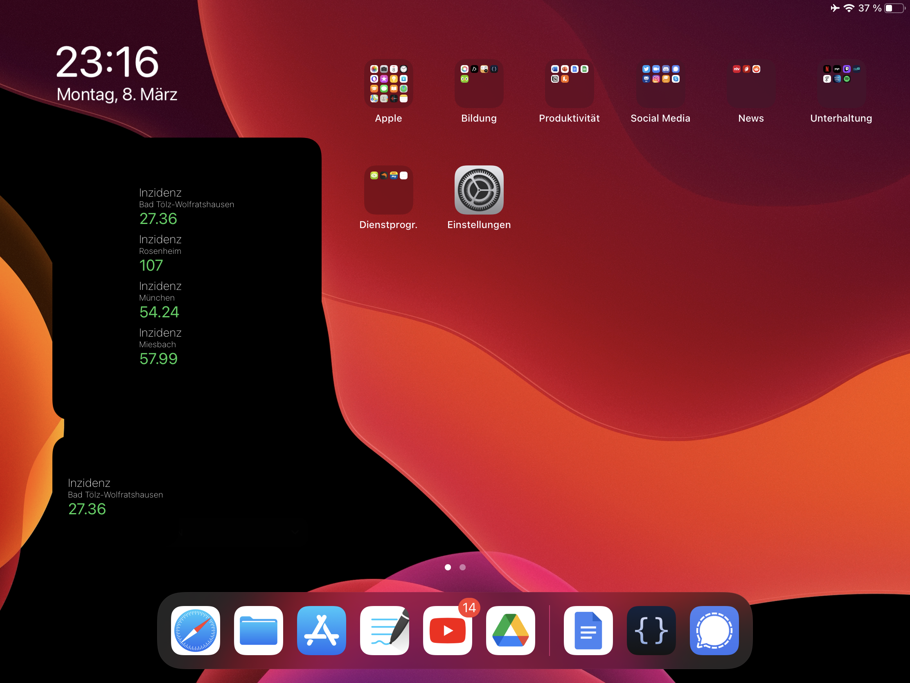

# Incidence-Widget-IOS
Corona Inzidenz Widget für Ipad/IPhone

## Installation:  
        - App Scriptable  
        - Neue Datei in Scriptable erstellen  
        - Code aud "Skript" einfügen  
        - Scriptable Widget zu Homescreen hinzufügen  
        - Die erstellte Datei als auszuführendes Skript auswählen  
        - Widgetparameter setzen (Landkreis(e) als Nummer durch Komma getrennt, z.B. "227,35,156")  
        - Nummer der Landkreise mit RKI API suchen:   

